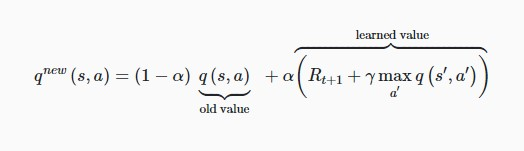

# QLearning-FrozenLake

This repo contains two implementations of the Q-Learning tehnique, to learn a policy to play the Frozen Lake game, an environment from OpenAI Gym.

---

Q-Values aproximation methods:
* Q-Table
* Deep Q Neural Network 

--- 

Formula for calculating the Q Value:

